# Análisis profundo de las redes Docker
En este documento se detallan: 
* diferentes modos de red disponibles en Docker, 
* los mecanismos de descubrimiento de servicios, 
* y procedimiento para unir contenedores entre sí.

Las siguientes redes están disponibles *de forma predeterminada*, cuando instala Docker en su computadora.

* Bridge - NAT - docker0
* Host - Utiliza la red de host
* None - Aislado / sin redes

# docker0 - The default "Bridge" network
```bash
 ~  docker network ls
NETWORK ID     NAME      DRIVER    SCOPE
eb79e02dd1fd   bridge    bridge    local
f206621b76ec   host      host      local
255776a128b8   none      null      local
```
Así es como se ve la red bridge predeterminada:

| 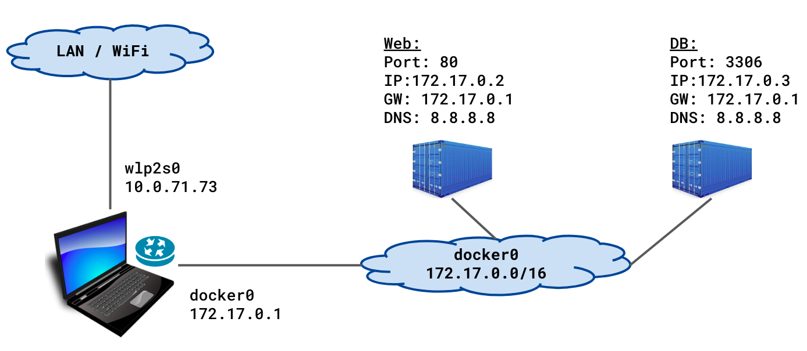 |

Otra forma de ver la red de puente predeterminada:

| 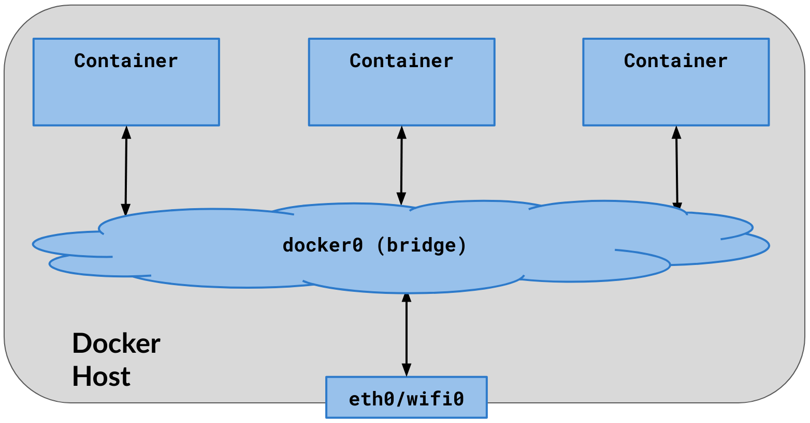 |

**Puntos importantes:**
* De manera predeterminada, todos los contenedores están conectados a la red puente predeterminada, a menos que se configure explícitamente para conectarse a otra red.
* Los contenedores se comunican con el host de Docker y el mundo exterior (`ip_forward=1` y NAT) 
* El host de Docker puede comunicarse con todos los contenedores usando sus direcciones IP
* La red de puente (interfaz) (predeterminada) es visible/disponible en la computadora host como `docker0`.
* Al iniciar, el motor de Docker encuentra una subred de red sin usar en el host de Docker (normalmente `172.17.0.0/16`) y asigna la primera dirección IP de esa red (normalmente `172.17.0.1`) al puente predeterminado: `docker0`.
* No hay **descubrimiento de servicios** en el puente predeterminado.

Veamos las interfaces de red en la computadora host:

```bash
dockerhost ~]$ ip addr show
. . .  
1: lo: <LOOPBACK,UP,LOWER_UP> mtu 65536 qdisc noqueue . . . 
    inet 127.0.0.1/8 scope host lo
. . . 
2: wlp2s0: <BROADCAST,MULTICAST,UP,LOWER_UP> ... state UP . . . 
    inet 10.10.71.73/24 brd 10.10.71.255 scope global dynamic wlp2s0
. . . 
9: docker0: <NO-CARRIER,BROADCAST,MULTICAST,UP> ... state DOWN  . . . 
    inet 172.17.0.1/16 brd 172.17.255.255 scope global docker0

```

**Nota:** `state` es *DOWN* cuando no hay contenedores en ejecución conectados a esta interfaz/puente de red.

Ejecute dos contenedores, que se conectarán automáticamente al bridge predeterminado:
```bash
dockerhost ~]$ docker run --name web \
                 -d praqma/network-multitool

dockerhost ~]$ docker run --name db \
                 -e MYSQL_ROOT_PASSWORD=secret \
                 -d mysql
dockerhost ~]$ docker ps
CONTAINER ID	 IMAGE                    COMMAND                 PORTS   NAMES
8eaf8debb553  mysql                     "docker-entrypoint.s…"  3306    db
8c3f594512b1  praqma/network-multitool  "nginx -g 'daemon of…"  80/tcp  web

```

Inspeccionar el bridge:

```bash
dockerhost ~]$ docker network inspect bridge
. . . 
        "Containers": {
            "8c3f594512b1...": {
                "Name": "web",
                "EndpointID": "ca36034a9eb1...",
                "MacAddress": "02:42:ac:11:00:02",
                "IPv4Address": "172.17.0.2/16",
            },
            "8eaf8debb553...": {
                "Name": "db",
                "EndpointID": "3158ac7dee51...",
                "MacAddress": "02:42:ac:11:00:03",
                "IPv4Address": "172.17.0.3/16",
            }
. . . 
"com.docker.network.bridge.name": "docker0",
```
### Las interfaces `veth` en redes puente:
Cuando se ejecutan contenedores y se conectan a redes de puentes, se crea un par de conectores de red. Uno se asigna al contenedor como `eth0` y el otro se asigna/conecta al puente como `vethX`, donde *X* es una cadena aleatoria.

```bash
dockerhost $ ip addr show
. . . 
9: docker0: <... UP,LOWER_UP> ... state UP
    link/ether 02:42:37:9e:00:f6 brd ff:ff:ff:ff:ff:ff
    inet 172.17.0.1/16 brd 172.17.255.255 scope global docker0
. . .
11: veth229dc64@if10: <... UP,LOWER_UP> . . . master docker0 state UP 
    link/ether 2e:a8:cc:3b:78:09 brd ff:ff:ff:ff:ff:ff link-netnsid 0
. . .
13: veth18066aa@if12: <... UP,LOWER_UP> . . . master docker0 state UP 
    link/ether 52:83:73:27:cf:e3 brd ff:ff:ff:ff:ff:ff link-netnsid 1
. . . 
```


|  |
| ----------------------------------------------------------------------------------- |


| 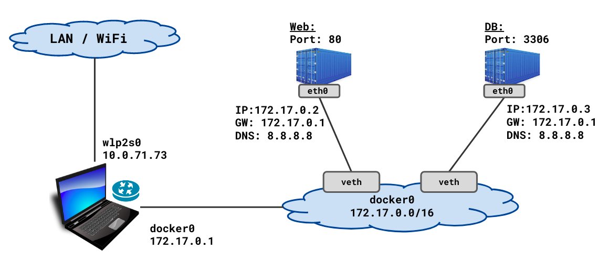 |
| ----------------------------------------------------------------------------------- |

### Inspeccionar los contenedores conectados a la red bridge:

```bash
dockerhost$ docker inspect web | egrep "MacAddress|IPAddress"
                    "IPAddress": "172.17.0.2",
                    "MacAddress": "02:42:ac:11:00:02",

dockerhost$ docker inspect db | egrep "MacAddress|IPAddress"
                    "IPAddress": "172.17.0.3",
                    "MacAddress": "02:42:ac:11:00:03",
```

```
dockerhost$ docker exec web ip addr show
. . . 
10: eth0@if11: <...UP,LOWER_UP> . . . state UP . . .
    link/ether 02:42:ac:11:00:02 brd ff:ff:ff:ff:ff:ff link-netnsid 0
    inet 172.17.0.2/16 brd 172.17.255.255 scope global eth0
```
Tenga en cuenta que la IP y la MAC del contenedor `web` que se muestran en el comando `docker inspect` son las mismas que las que se encuentran en la salida del comando `docker exec`.

### Comunicación en el bridge predeterminado docker0:

* El contenedor hereda la configuración DNS del demonio de Docker (del host), incluidos `/etc/hosts` y `/etc/resolv.conf`
* No hay **descubrimiento de servicios** en el puente predeterminado
* Dado que no hay descubrimiento de servicios, los contenedores deben conocer la IP de cada uno para poder comunicarse entre sí, a menos que use '--link'; esto no es escalable más allá de 2 o 3 contenedores y está en desuso
* Intentar encontrar la dirección IP de los otros contenedores es complicado
* Todos los puertos de un contenedor están expuestos a todos los demás contenedores en la misma red de puente. No se publican puertos en el host de forma predeterminada
* La publicación de puertos de contenedor en el host implica realizar un seguimiento de qué contenedor publica qué puerto en el host.

Comunicación en el bridge docker0 predeterminado:

```bash
dockerhost ~]$ docker exec -it web /bin/sh

/ # ping db
ping: db: Name does not resolve

/ # ping 172.17.0.3
PING 172.17.0.3 (172.17.0.3) 56(84) bytes of data.
64 bytes from 172.17.0.3: icmp_seq=1 ttl=64 time=0.154 ms

# telnet 172.17.0.3 3306
J
8.0.1Z	7lQ.	�L]VP7}Q:T,caching_sha2_password
^]
/ #
```
## Red bridge "definida por el usuario":
Los usuarios pueden crear su propia red Docker. Esto tiene ciertas ventajas, la más importante de las cuales es el *descubrimiento de servicios (DNS)*. 

| 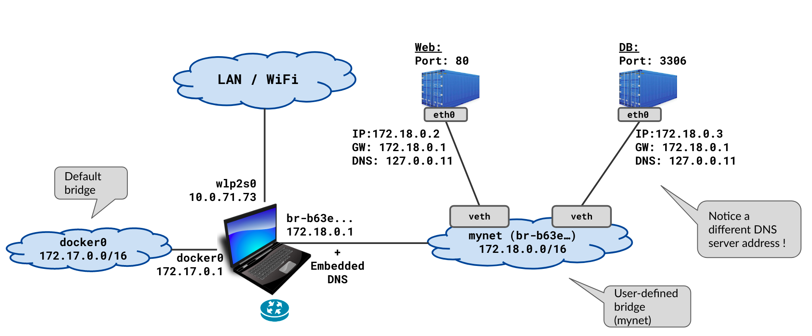| 
| ---------------------------------------------------------------------------------------------- |

Crear un bridge network:

```bash
dockerhost ~]$ docker network create mynet

dockerhost ~]$ docker network ls
NETWORK ID          NAME                DRIVER              SCOPE
c0a96220208b        bridge              bridge              local
c46f23496264        host                host                local
b63ec54532ae        mynet               bridge              local
2c77e24c2352        none                null                local

dockerhost ~]$ docker network inspect mynet
. . .
"Subnet": "172.18.0.0/16",
    "Gateway": "172.18.0.1"
. . . 
```
Debería aparecer como una interfaz de red en el host con el nombre `br-<random-string>`.

```bash
dockerhost ~]$ ip addr show
. . . 
9: docker0: <...MULTICAST,UP> ... state DOWN ... 
    link/ether 02:42:37:9e:00:f6 brd ff:ff:ff:ff:ff:ff
    inet 172.17.0.1/16 brd 172.17.255.255 scope global ...
. . . 
14: br-b63ec54532ae: <...MULTICAST,UP> ... state DOWN ...
    link/ether 02:42:ae:c2:65:74 brd ff:ff:ff:ff:ff:ff
    inet 172.18.0.1/16 brd 172.18.255.255 scope global ...

. . . 
```
Observe que el ID del bridge "mynet" es "br-b63e...". 

Ahora detenga ambos contenedores. Ejecute nuevamente los dos contenedores y conéctelos a esta red que acaba de crear:

```bash
dockerhost ~]$ docker run --name=web --network=mynet \
             -d praqma/network-multitool

dockerhost ~]$ docker run --name=db --network=mynet \
             -e MYSQL_ROOT_PASSWORD=secret \
             -d mysql

$ docker ps
CONTAINER ID  IMAGE                     COMMAND                 PORTS     NAMES
34f8f56fe8b2  mysql                     "docker-entrypoint.s…"  3306/tcp  db
1d480f66ce00  praqma/network-multitool  "nginx -g 'daemon of…"  80/tcp    web
```

Inspeccionar la red:

```bash
dockerhost ~]$ docker network inspect mynet
. . .
        "Name": "mynet",
                    "Subnet": "172.18.0.0/16",
                    "Gateway": "172.18.0.1"
. . . 
                "Name": "web",
                "MacAddress": "02:42:ac:12:00:02",
                "IPv4Address": "172.18.0.2/16",
. . . 
                "Name": "db",
                "MacAddress": "02:42:ac:12:00:03",
                "IPv4Address": "172.18.0.3/16",
```

Tenga en cuenta que los contenedores conectados a `mynet` aparecen en la salida cuando se inspecciona la red "mynet".

### Descubrimiento de servicio en el bridge definido por el usuario:

**Existe un servicio de detección (basado en DNS)** en el puente definido por el usuario. ¿Cómo funciona y cómo se ve? - se explica a continuación.

`exec` en un contenedor conectado a la red que acaba de crear. Observe que puede resolver los nombres de los otros contenedores en la misma red.

```bash
dockerhost ~]$ docker exec -it web /bin/sh
/ # ping -c 1 db 
PING db (172.18.0.3) 56(84) bytes of data.
64 bytes from db.mynet (172.18.0.3): icmp_seq=1 ttl=64 time=0.084 ms

/ # ping -c 1 yahoo.com
PING yahoo.com (72.30.35.10) 56(84) bytes of data.
64 bytes from media-router-fp2.prod1.media.vip.bf1.yahoo.com (72.30.35.10): icmp_seq=1 ttl=52 time=165 ms

/ # dig +short yahoo.com
98.137.246.8
72.30.35.10
. . . 
```
Lo anterior funciona porque hay un **DNS integrado** en el servicio Docker en la computadora host. Se explica a continuación.
 
| 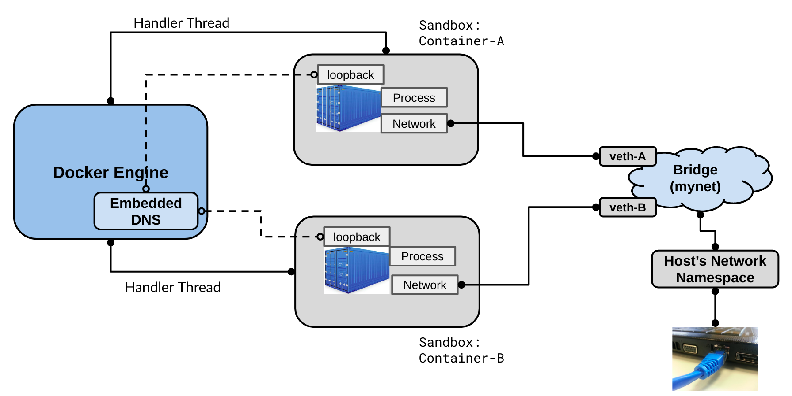 |
| ------------------------------------------------------------------------------- |

`exec` en un contenedor conectado a `mynet` y realizar alguna investigación.

```bash
dockerhost ~]$ docker exec web cat /etc/resolv.conf
search home.wbitt.com
nameserver 127.0.0.11
options ndots:0

dockerhost ~]$ docker exec db cat /etc/resolv.conf
search home.wbitt.com
nameserver 127.0.0.11
options ndots:0

dockerhost ~]$ docker exec web netstat -antup
Active Internet connections (servers and established)
Proto Recv-Q Send-Q Local Address     Foreign Address   State       PID/Program
tcp        0      0 127.0.0.11:40521  0.0.0.0:*         LISTEN      -
tcp        0      0 0.0.0.0:80        0.0.0.0:*         LISTEN      1/nginx
udp        0      0 127.0.0.11:38657  0.0.0.0:*                     -
```
El archivo `/etc/resolv.conf` indica que el DNS está disponible en `127.0.0.11` y en el puerto `53`, lo cual está implícito. Pero la salida de `netstat` no muestra ningún proceso escuchando en el puerto `53`, ni en TCP ni en UDP. Entonces, ¿dónde está el servidor DNS?

Agreguemos un contenedor de *tools* a "mynet", para mirar bajo el capó. Necesitamos algunas **CAP-abilities* adicionales para nuestro contenedor que se usará para la investigación.
#### Parametros adicionales
--cap-add=NET_ADMIN
Este parámetro le otorga al contenedor el capacidad adicional de administrar redes. Con esta capacidad, el contenedor obtiene permisos para realizar ciertas operaciones administrativas de red, como crear interfaces de red, cambiar configuraciones de red o habilitar enrutamiento.

Este permiso se agrega porque, por defecto, los contenedores Docker tienen permisos limitados por razones de seguridad. Usar --cap-add=NET_ADMIN es necesario cuando el contenedor necesita administrar o modificar configuraciones de red.
--cap-add=NET_RAW
Este parámetro le otorga al contenedor la capacidad de usar sockets de red en bruto, lo que permite que el contenedor envíe y reciba paquetes de red sin el protocolo TCP/IP estándar.

Se suele requerir este permiso cuando un contenedor necesita realizar operaciones de red de bajo nivel, como la creación de paquetes personalizados o el uso de herramientas como ping, traceroute, etc.

```bash
$dockerhost ~] docker run \
                  --name multitool \
                  --network mynet \
                  --cap-add=NET_ADMIN \
                  --cap-add=NET_RAW \
                  -it praqma/network-multitool /bin/bash

bash-5.0# ping -c 1 db
PING db (172.18.0.3) 56(84) bytes of data.
64 bytes from db.mynet (172.18.0.3): icmp_seq=1 ttl=64 time=0.074 ms

bash-5.0# dig db
;; QUESTION SECTION:
;db.        IN    A

;; ANSWER SECTION:
db.     600	IN    A   172.18.0.3

;; SERVER: 127.0.0.11#53(127.0.0.11)
```

Observe que el servidor DNS que responde a nuestras consultas DNS es: `127.0.0.11#53`, pero no vemos ningún proceso ejecutándose en el puerto `53` en este contenedor. ¿Qué está pasando aquí?

Verifique la salida de netstat en este contenedor *tools*:

**Observaciones:**
* Los puertos `37553` y `35464` no parecen puertos de servidor DNS. ¿Qué son?
* ¿Por qué estos procesos dentro del contenedor no tienen PID?

Respuesta a todos los misterios de DNS: **¡La magia de IPTables!**

Consulta las reglas de iptables en el contenedor tools:
```bash
bash-5.0# iptables-save 
*nat
:PREROUTING ACCEPT [18:2796]
:INPUT ACCEPT [0:0]
:OUTPUT ACCEPT [4:171]
:POSTROUTING ACCEPT [9:502]
:DOCKER_OUTPUT - [0:0]
:DOCKER_POSTROUTING - [0:0]
-A OUTPUT -d 127.0.0.11/32 -j DOCKER_OUTPUT
-A POSTROUTING -d 127.0.0.11/32 -j DOCKER_POSTROUTING

# Queries for DNS:
-A DOCKER_OUTPUT -d 127.0.0.11/32 -p tcp -m tcp --dport 53 -j DNAT --to-destination 127.0.0.11:37553
-A DOCKER_OUTPUT -d 127.0.0.11/32 -p udp -m udp --dport 53 -j DNAT --to-destination 127.0.0.11:35464

# Response from DNS:
-A DOCKER_POSTROUTING -s 127.0.0.11/32 -p tcp -m tcp --sport 37553 -j SNAT --to-source :53
-A DOCKER_POSTROUTING -s 127.0.0.11/32 -p udp -m udp --sport 35464 -j SNAT --to-source :53
```

**Explicación:**
De las reglas de `iptables`, aprendemos que cualquier tráfico (consulta DNS) que busque `127.0.0.11:53` se redirige en realidad a `127.0.0.11:37553` (para TCP) y a `127.0.0.11:35464` (para UDP). 

Hay un proceso de Docker ejecutándose en estos puertos dentro del contenedor, que en realidad son los ganchos del DNS integrado de Docker. Cuando se envía algo en estos ganchos, el DNS integrado de Docker responde con los resultados de la consulta.

Las últimas dos reglas de `iptables` muestran que cuando se reciben los resultados/tráfico DNS de retorno desde estos dos puertos especiales (o procesos), se vuelven a cambiar (SNAT - Traducción de dirección de red de origen) a la misma dirección IP pero con el puerto 53 como puerto de origen. En el caso de los comandos inocentes `dig` o `nslookup`, la consulta se dirigía a `127.0.0.11:53` y los resultados se obtenían del mismo sitio. ¡Esta es la historia! A continuación se muestra el diagrama, que debería ayudar a entender toda esta explicación.

| 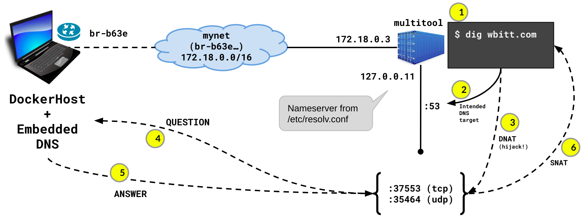 |
| ------------------------------------------------------------------------------- |

**Notas:**
* El comando anterior (`iptables`) no funcionará sin agregar ciertas capacidades CAP al contenedor en tiempo de ejecución. Por eso usamos las capacidades CAP adicionales: `--cap-add=NET_ADMIN` y `--cap-add=NET_RAW`
* De manera predeterminada, DNS usa UDP para consultas de menos de 512 bytes. Cambia a TCP para consultas de más de 512 bytes. UDP es más rápido, más simple y más liviano.

## Red bridge "definida por docker-compose":
Esto es exactamente lo mismo que el puente *definido por el usuario*, excepto que `docker-compose` lo crea automáticamente cuando se activa una pila de aplicaciones basada en `docker-compose`.

A continuación se muestra una pila de aplicaciones `docker-compose` simple:

```yml
simpleweb]$ cat docker-compose.yml 
version: "3"
services:
  apache:
    image: httpd:alpine
  postgres:
    image: postgres
    environment:
      - POSTGRES_PASSWORD=secret
```
Abra la pila de compose e investigue su red.

```bash
simpleweb]$ docker-compose up -d
Creating network "simpleweb_default" 
Creating simpleweb_apache_1   ... done
Creating simpleweb_postgres_1 ... done

simpleweb]$ docker network ls
NETWORK       ID                  NAME
c0a96220208b  bridge              bridge
c46f23496264  host                host
b63ec54532ae  mynet               bridge
2c77e24c2352  none                null
245ef6384978  simpleweb_default   bridge
```
```bash
simpleweb]$ docker-compose ps
        Name                      Command              State    Ports  
-----------------------------------------------------------------------
simpleweb_apache_1     httpd-foreground                Up      80/tcp  
simpleweb_postgres_1   docker-entrypoint.sh postgres   Up      5432/tcp
```
```bash
dockerhost ~]$ ip addr show
. . . 
29: br-245ef6384978: <... UP,LOWER_UP> ... state UP ...
      link/ether 02:42:bf:f0:d6:04 brd ff:ff:ff:ff:ff:ff
      inet 172.19.0.1/16 brd 172.19.255.255 scope global br-245ef6384978

31: vethd85cd5e@if30: <... UP,LOWER_UP> ... master br-245ef6384978 state UP .. 
      link/ether 72:7c:3e:bf:8a:b6 brd ff:ff:ff:ff:ff:ff link-netnsid 2

33: veth2ed0387@if32: <... UP,LOWER_UP> ... master br-245ef6384978 state UP 
      link/ether 62:6f:4c:77:19:4f brd ff:ff:ff:ff:ff:ff link-netnsid 3
```
Observe que se crea el nuevo puente para la aplicación de composición y aparecen dos interfaces `veth` para los dos contenedores conectados en ese puente.


| 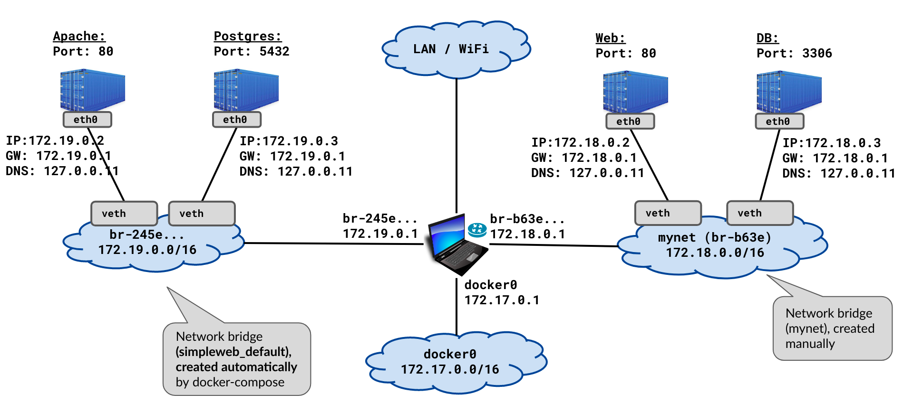 |
| ----------------------------------------------------------------------------------------------------- |

## Otros aspectos de las redes de puentes:
### No hay detección de servicios ni comunicación entre redes de puentes "diferentes":
En caso de que haya varias redes de Docker en la misma computadora, los contenedores de una red no saben que hay contenedores en la otra red ni pueden comunicarse con ellos. Esto es bueno por razones de seguridad.
Así es como se investiga:

```bash
dockerhost ~]$ docker exec -it docker-network-apache-1 /bin/sh

/usr/local/apache2 # ping postgres
PING postgres (172.19.0.3): 56 data bytes
64 bytes from 172.19.0.3: seq=0 ttl=64 time=0.188 ms

/usr/local/apache2 # ping db
ping: bad address 'db'

/usr/local/apache2 # ping 172.18.0.2
PING 172.18.0.2 (172.18.0.2): 56 data bytes
2 packets transmitted, 0 packets received, 100% packet loss

/usr/local/apache2 # ping 172.18.0.1
PING 172.18.0.1 (172.18.0.1): 56 data bytes
64 bytes from 172.18.0.1: seq=0 ttl=64 time=0.105 ms
```
Tenga en cuenta que los contenedores de una red de puente no pueden resolver los nombres de los contenedores en las otras redes de Docker y no pueden comunicarse con los contenedores en otras redes de Docker, lo cual es *¡bueno!*

Lo mismo se aplica a los contenedores en la *otra* red:

```bash
dockerhost]$ docker exec -it web /bin/sh

/ # ping db
PING db (172.18.0.3) 56(84) bytes of data.
64 bytes from db.mynet (172.18.0.3): icmp_seq=1 ttl=64 time=0.085 ms

/ # ping postgres
ping: postgres: Name does not resolve

/ # ping 172.19.0.3
PING 172.19.0.3 (172.19.0.3) 56(84) bytes of data.
1 packets transmitted, 0 received, 100% packet loss, time 0ms

/ # ping 172.19.0.1
PING 172.19.0.1 (172.19.0.1) 56(84) bytes of data.
64 bytes from 172.19.0.1: icmp_seq=1 ttl=64 time=0.081 ms
``` 
## La red "Host" de Docker:

| 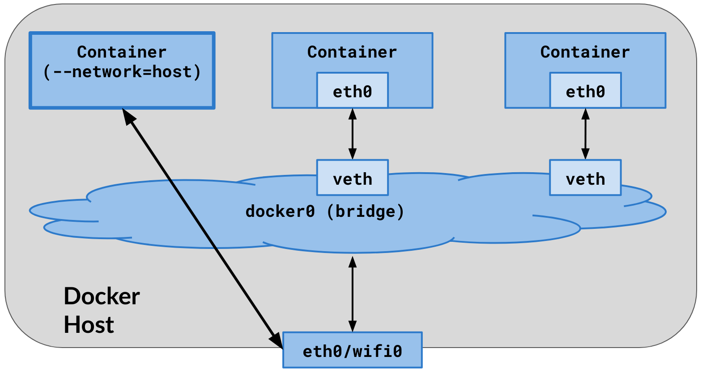 |
| ----------------------------------------------------------------- |

* El contenedor comparte el *espacio de nombres de red* del host
* La pila de red del contenedor no está aislada del host de Docker
* No se crean pares `veth` en el host. Todas las interfaces de red del host son visibles dentro del contenedor.
* Todo el enrutamiento de la computadora host es visible dentro del contenedor.
* No se asigna ninguna dirección IP al contenedor, la comparte con el host.
* La asignación de puertos no tiene efecto. Las opciones “-p” y “-P” se ignoran. Cualquiera sea el puerto de la aplicación dentro del contenedor, está disponible tal como está en la dirección IP del host.
* Útil para optimizar el rendimiento, ya que no requiere NAT entre el host y el contenedor. No se crea ningún “proxy de espacio de usuario” para cada puerto del contenedor.
* La red de host solo funciona en hosts Linux

Así es como se ven los contenedores en la red del host:

```bash
dockerhost ~]$ docker run --name multitool --network host \
                 -d praqma/network-multitool

dockerhost ~]$ docker ps
CONTAINER ID  IMAGE                    COMMAND     CREATED        STATUS        PORTS   NAMES
dc61439f5546  praqma/network-multitool "nginx ..." 1 minute ago   Up 37 seconds         multitool

dockerhost ~]$ docker exec -it multitool /bin/sh
/ # ip addr show
1: lo: <LOOPBACK,UP,LOWER_UP> mtu 65536 state UNKNOWN group default qlen 1000
    link/loopback 00:00:00:00:00:00 brd 00:00:00:00:00:00
    inet 127.0.0.1/8 scope host lo
       valid_lft forever preferred_lft forever
2: wlp2s0: <BROADCAST,MULTICAST,UP,LOWER_UP> mtu 1500 state UP group default qlen 1000
    link/ether 34:f3:9a:27:e7:2d brd ff:ff:ff:ff:ff:ff
    inet 192.168.0.14/24 brd 192.168.0.255 scope global dynamic noprefixroute wlp2s0
9: docker0: <NO-CARRIER,BROADCAST,MULTICAST,UP> mtu 1500 state DOWN group default 
    link/ether 02:42:d4:fa:e4:ea brd ff:ff:ff:ff:ff:ff
    inet 172.17.0.1/16 brd 172.17.255.255 scope global docker0
```
Inspeccione el contenedor e investigue su red.

```bash
dockerhost ~]$ docker container inspect nginx 
. . . 
            "Pid": 2905,
. . . 
        "Name": "/nginx",
. . . 
            "NetworkMode": "host",
. . . 
            "ExposedPorts": {
                "80/tcp": {}
. . . 
            "Networks": {
                "host": {
. . . 
                    "IPAddress": "",
. . . 
                    "MacAddress": "",
```

```bash
dockerhost ~]# netstat -ntlp
Active Internet connections (only servers)
Proto Recv-Q Send-Q Local Address Foreign Address   State       PID/Program
. . . 
tcp        0      0 127.0.0.1:631 0.0.0.0:*         LISTEN      1131/cupsd
tcp        0      0 0.0.0.0:80    0.0.0.0:*         LISTEN      2905/nginx
tcp        0      0 0.0.0.0:443   0.0.0.0:*         LISTEN      2905/nginx

dockerhost ~]$ curl localhost
Praqma Network MultiTool (with NGINX) - kworkhorse.home.wbitt.com -  
```
**Notas:**
* El script *entrypoint* del contenedor multitool es responsable de crear la página web anterior con la dirección IP del contenedor. 
Como el contenedor no tiene ninguna interfaz de red propia, el script no encontró ninguna dirección IP para él y dejó la dirección IP vacía 
en la página web generada. ¡Es por eso que no hay una dirección IP en la salida del comando `curl` anterior!
* Como el contenedor usa la red del host, sus servicios son accesibles directamente en la computadora host, usando `localhost` 
y en la dirección IP de red del host conectado a LAN/wifi.

## La red "none":
| 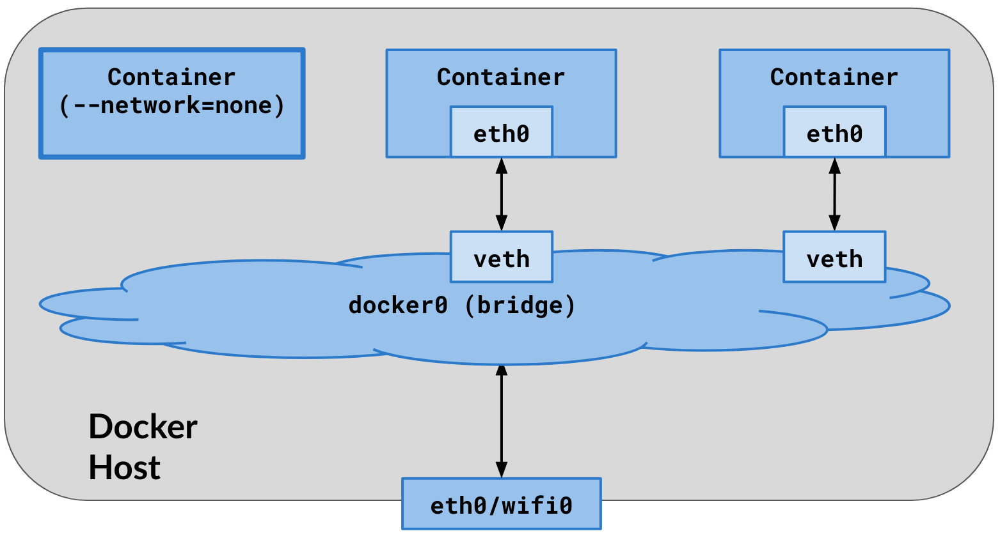 |
| ----------------------------------------------------------------- |

* La red del contenedor está completamente deshabilitada. No hay IP, ni tráfico de entrada ni de salida.
* Solo está disponible el dispositivo de bucle invertido
* No se crean pares `veth` en el host.
* La asignación de puertos no tiene efecto. Las opciones “-p” y “-P” se ignoran. 
* Se utiliza como un entorno de seguridad para probar algo en completo aislamiento.

Ejecutemos un contenedor conectándolo a la red "none":
```bash
dockerhost ~]$ docker run --name multitool \
                --network none \
                -p 80:80 \
                -d praqma/network-multitool

dockerhost ~]$ docker ps
CONTAINER ID  IMAGE   COMMAND     CREATED     STATUS    PORTS   NAMES
6f0637d31ebe  nginx   “nginx …”   2 min ago   Up 2 min          multitool

dockerhost ~]$ docker exec -it multitool /bin/bash
bash-5.0# ifconfig -a
lo        Link encap:Local Loopback  
          inet addr:127.0.0.1  Mask:255.0.0.0
          UP LOOPBACK RUNNING  MTU:65536  Metric:1

bash-5.0# route -n
Kernel IP routing table
Destination     Gateway         Genmask         Flags Metric Ref    Use Iface
bash-5.0# 
```
Tenga en cuenta que pasar `-p 80:80` no tiene ningún efecto. Observe también que no hay interfaces de red en el contenedor ni tabla de enrutamiento.

------
# Unir un contenedor a otro contenedor
La mayoría de las veces, los contenedores están muy limitados en términos de la cantidad de software/herramientas que contienen. Esto se hace para mantener su tamaño pequeño y también por razones de seguridad. Sin embargo, la resolución de problemas se vuelve muy difícil, ya que no tienen suficientes herramientas en ellos. Existe la posibilidad de unir un contenedor de *herramientas* a un contenedor *principal*. 

Algunos ejemplos de estos contenedores limitados son: `nginx`, `mysql`, etc., o imágenes creadas desde `scratch`. 
Algunos ejemplos de contenedores de herramientas son: `busybox`, `alpine`, `praqma/network-multitool`, etc.

## Unir un contenedor al espacio de nombres de red de otro contenedor:

| 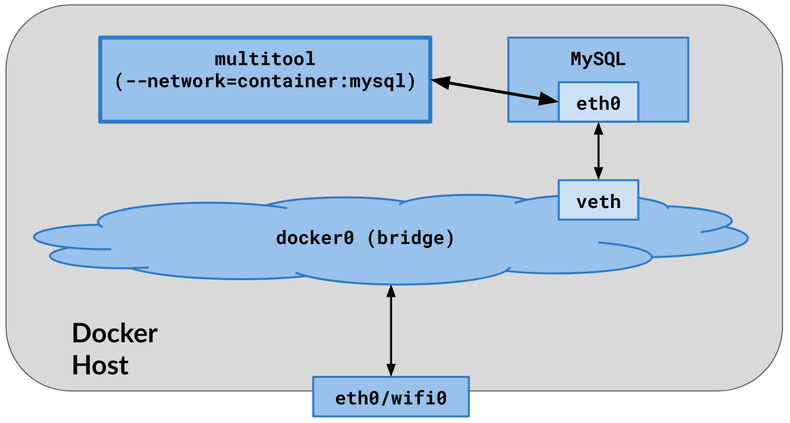 |
| ----------------------------------------------------------------------- |

* El contenedor al que se une no tiene una IP propia. Se une al espacio de nombres de red/IP del contenedor principal.
* No se crean interfaces `veth` adicionales en el host para el contenedor al que se une. 
* El contenedor al que se une no puede ver los procesos del contenedor principal.

Ejecutemos un contenedor `mysql` típico, que no tiene ninguna herramienta de resolución de problemas en su interior. Investiguemos el contenedor utilizando herramientas de administración de procesos y redes:


```bash
dockerhost ~]$ docker run --name mysql -e MYSQL_ROOT_PASSWORD=secret -d mysql

dockerhost ~]$ docker ps
CONTAINER ID  IMAGE   COMMAND      CREATED    STATUS     PORTS     NAMES
e53613c1ebe1  mysql   "docker …"   1 min ago  UP 1 min   3306/tcp  mysql

dockerhost ~]$ docker exec -it mysql /bin/sh

# ifconfig
/bin/sh: 2: ifconfig: not found

# ping 8.8.8.8
/bin/sh: 3: ping: not found

# ps aux
/bin/sh: 4: ps: not found
```
Muy bien, adjuntemos un contenedor de *tools* a este contenedor para solucionar problemas:

```bash
dockerhost ~]$ docker run --name busybox \
                 --network container:mysql \
                 --rm -it busybox /bin/sh

/ # ip addr show
. . . 
46: eth0@if47: <...UP,LOWER_UP> ... qdisc noqueue state UP 
      link/ether 02:42:ac:11:00:02 brd ff:ff:ff:ff:ff:ff link-netnsid 0
      inet 172.17.0.2/16 brd 172.17.255.255 scope global eth0

/ # netstat -ntlp
Active Internet connections (only servers)
Proto Recv-Q Send-Q Local Address	Foreign Address	State	PID/Program    
tcp6       0      0 :::3306       :::*          	LISTEN	-                   

/ # ping 8.8.8.8
64 bytes from 8.8.8.8: icmp_seq=1 ttl=54 time=17.4 ms
```

Investiga cómo se ven las cosas desde la perspectiva de Docker:

```bash
dockerhost ~]$ docker ps
CONTAINER ID  IMAGE     COMMAND     CREATED     STATUS     PORTS      NAMES
e53613c1ebe1  mysql     "docker …"  15 min ago  UP 15 min  3306/tcp   mysql
2acc045dc3cd  busybox   "/docker …" 12 min ago  Up 12 min             busybox

dockerhost ~]$ docker inspect mysql
    . . . 
    "NetworkMode": "default",
    . . . 
        "IPAddress": "172.17.0.2",
        "MacAddress": "02:42:ac:11:00:02",
dockerhost ~]$ docker inspect busybox
    . . . 
    "NetworkMode": "container:e53613c1ebe1",
    . . . 
        "IPAddress": "",
        "MacAddress": "",
```
Tenga en cuenta que el contenedor de herramientas no tiene una dirección IP.

Ahora bien, cuando un contenedor se une al espacio de nombres de red de otro contenedor, ¿podemos ver también los procesos dentro del otro contenedor? Lamentablemente, no. Unirse a la red de un contenedor no ayuda si queremos ejecutar herramientas de resolución de problemas de procesos, como `ps`, `strace`, `gdb`, etc., en los procesos del contenedor principal, porque los procesos del contenedor principal no son visibles para el contenedor de herramientas.

```bash
dockerhost ~]$ docker run --name busybox \
               --network container:mysql \
               --rm -it busybox /bin/sh

/ # ps aux
PID   USER     TIME  COMMAND
    1 root      0:00 /bin/sh
    6 root      0:00 ps aux
/ # 
```
Tenga en cuenta que estamos dentro del contenedor `busybox` y no hay ningún proceso `mysql` visible.

## Unir un contenedor al espacio de nombres de proceso de otro contenedor
Para poder administrar los procesos del contenedor principal, el contenedor de herramientas debe estar conectado al espacio de nombres del proceso del contenedor principal.

| 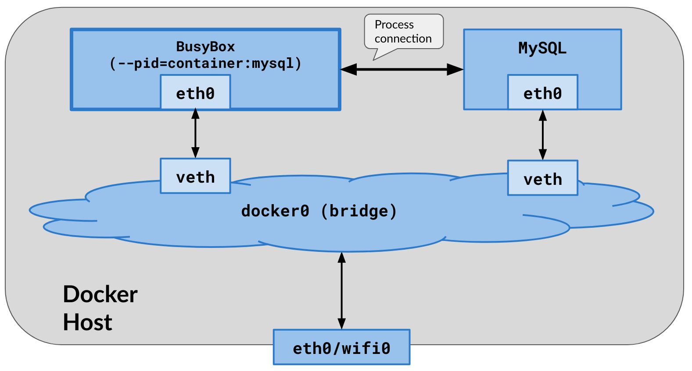 |
| ----------------------------------------------------------------------- |

Para ver los procesos del contenedor principal `mysql`, haga que el contenedor `busybox` se una al *process-namespace* del contenedor `mysql`, usando: `--pid contenedor:<MainContainerID>`

```bash
dockerhost ~]$ docker run --name busybox \
                 --pid container:mysql \
                 --rm -it busybox /bin/sh

/ # ps aux
PID   USER     TIME  COMMAND
    1 999       0:25 mysqld
  505 root      0:00 /bin/sh
  510 root      0:00 ps aux
/ # 
```

Observe que estamos dentro del contenedor `busybox` y ahora también vemos el proceso `mysql`. 

Recuerde que, cuando se ejecuta de esta manera, el contenedor que se une obtiene su propia pila de red, diferente de la pila de red del contenedor principal al que se une. Así es como se ve: 

```bash
/ # ip addr show
1: lo: <LOOPBACK,UP,LOWER_UP> mtu 65536 qdisc noqueue qlen 1000
    inet 127.0.0.1/8 scope host lo
. . . 
48: eth0@if49: <...UP,LOWER_UP,M-DOWN> mtu 1500 qdisc noqueue 
    inet 172.17.0.3/16 brd 172.17.255.255 scope global eth0
```
Tenga en cuenta que la IP del contenedor MySQL es `172.17.0.2`, que es diferente de la del contenedor `busybox` que se muestra aquí.

## ¡Únase a la red y al espacio de nombres de procesos del contenedor principal en un solo paso!
De hecho, podemos unir un contenedor de *tools* a los espacios de nombres de red y de procesos del contenedor principal. De esa manera, podemos administrar/trabajar con la red y la administración de procesos del contenedor principal.

| 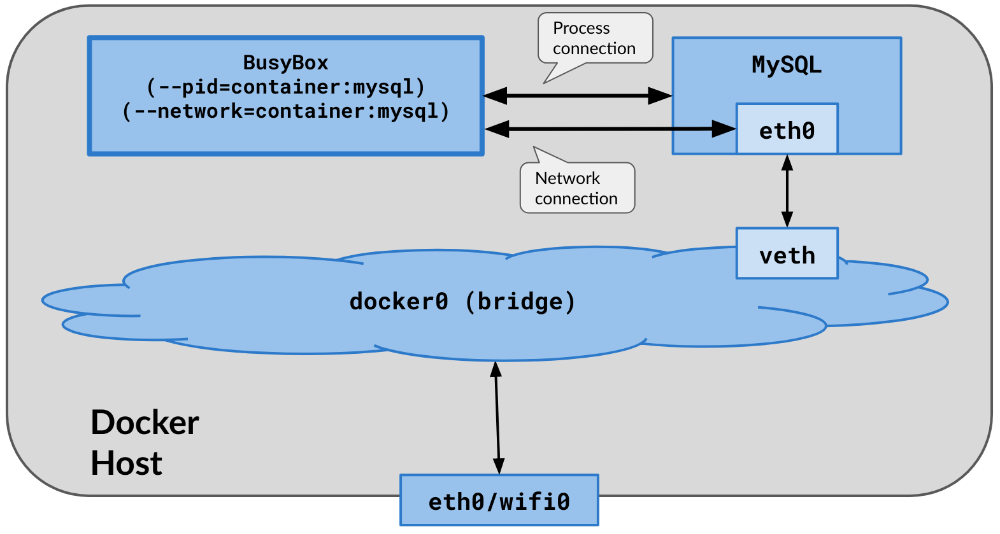 |
| --------------------------------------------------------------------------------------- |

Así es como funciona:
```bash
dockerhost ~]$ docker run --name busybox \
                 --network container:mysql \
                 --pid container:mysql \
                 --rm -it busybox /bin/sh

/ # ip addr show
. . . 
48: eth0@if47: <...UP,LOWER_UP,M-DOWN> mtu 1500 qdisc noqueue 
link/ether 02:42:ac:11:00:02 brd ff:ff:ff:ff:ff:ff
    inet 172.17.0.2/16 brd 172.17.255.255 scope global eth0

/ # ps aux
PID   USER     TIME  COMMAND
    1 999       0:33 mysqld
  513 root      0:00 /bin/sh
  518 root      0:00 ps aux
```
Tenga en cuenta la IP y la MAC del contenedor `mysql` y los procesos de ambos contenedores, ¡todos visibles en el contenedor `busybox`!